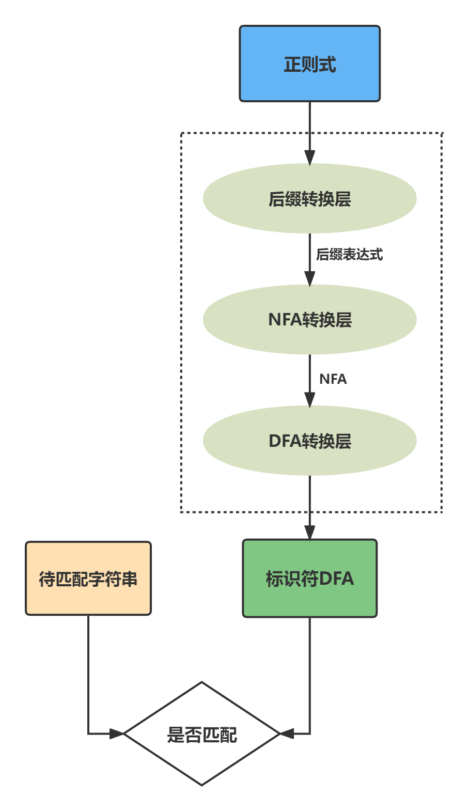
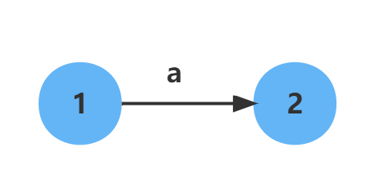
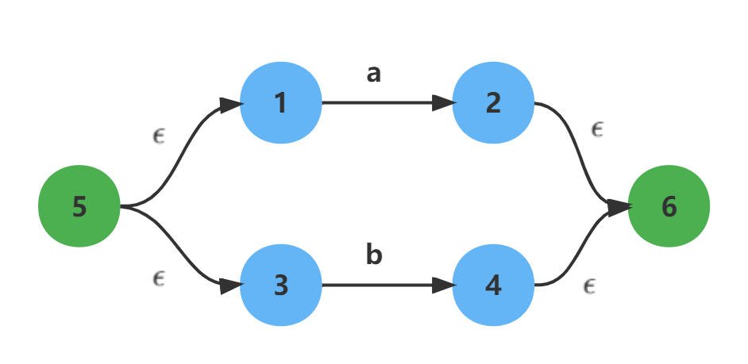
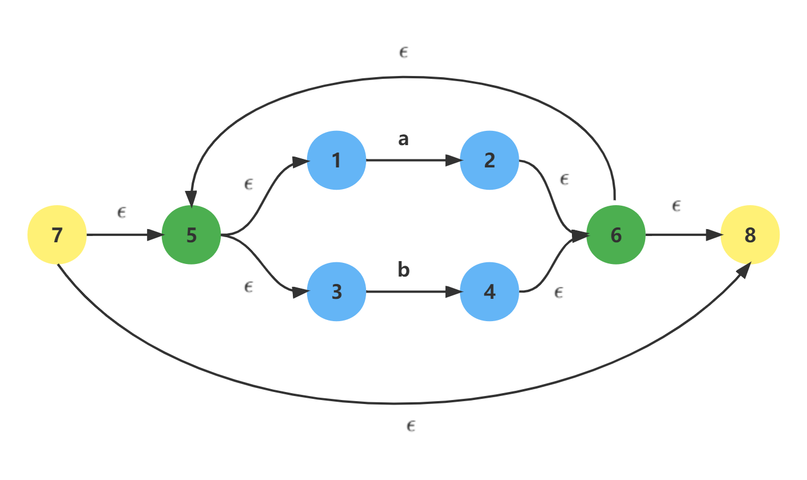
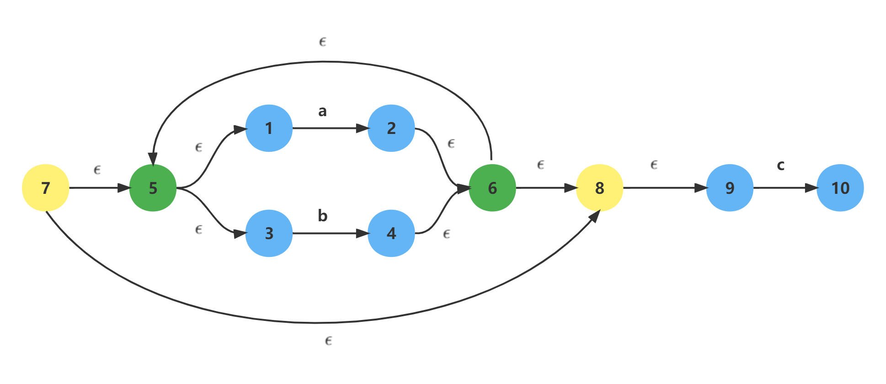

# 一个简易的正则引擎

## 引擎结构

该引擎的核心结构如下，共分为三层：

<div align=center>

</div>

| 转换层 | 作用 | 算法 |
| --- | --- | --- |
| 后缀转换层 | 中缀正则式 → 后缀正则式 | 中缀转后缀算法 |
| NFA转换层 | 后缀正则式 → NFA | Thompson 构造法 |
| DFA转换层 | NFA → DFA | 子集构造法 |

### 1. 后缀转换层

对于输入的正则式，如`(a|b)*abb`，这样的原始表达式是中缀形式的，若将中缀形式的表达式直接转换为NFA，这对于计算机来说并不适合处理，因此需要先转换为后缀形式。

1. **填充连接符&**
   
    正则式对于**运算连接符&**是隐式的，因此需要将正则式填充上**连接符&**，例如`(a|b)*abb`填充后转换为`(a|b)*&a&b&b`。
    
2. **中缀 → 后缀**
   
    该步骤是常见算法，是借助栈来实现的，从而实现`(a|b)*&a&b&b` → `ab|*a&b&b&`。
    

### 2. NFA转换层

该层接收一个后缀的正则式，通过[Thompson 构造法](https://blog.csdn.net/weixin_44691608/article/details/110195743)，来完成**后缀表达式 → NFA**的转换。

1. **数据结构**
   
    以**邻接表的方式**存取NFA的网络图。
    
2. **Thompson 构造法**

    Thompson 构造法针对每一种正则式中的运算，都建立了一种基本转换规则，例如：

    1. **单个字符**
       
        
        
    2. **或**
       
        
        
    3. **闭包**
       
        
        
    4. **连接**
       
        


### 3. DFA转换层

该层接收一个NFA对象，并通过子集构造法转换为DFA。

**子集构造法**

1. epsilon -closure(s)：返回所有s中的NFA状态可经任意长度的 ϵ 边抵达的状态集合
2. move(A,\  a)：DFA 状态A中的每个NFA状态经过一次a边能抵达的所有NFA状态的集合。

```cpp
Subset-Construction(NFA)
    let Dtran be a table
		# DFA 状态集合的初始状态为 NFA 初始状态的闭包，并且未标记
    DFA_States = {ε-closure(NFA.s0)}  
    while (exist T in DFA_States not marked) { # 存在未标记的 DFA 状态
        mark T  # 标记 T，表示查过 T 状态的所有后续状态了
        for (a in Σ) { # Σ: 符号集
            Tc = ε-closure(move(T, a)) # 找到所有输入字符对应的下一个状态
            if (Tc not in DFA_States) { # 将状态加入到 DFA_States
                push Tc in DFA_States & unmarked Tc
            }
            Dtran[T, a] = Tc
        }
    }
    return Dtran
```

**视频理解**

[编译原理_哈尔滨工业大学](https://www.icourse163.org/learn/HIT-1002123007?tid=1467039443#/learn/content?type=detail&id=1247387247&sm=1)
